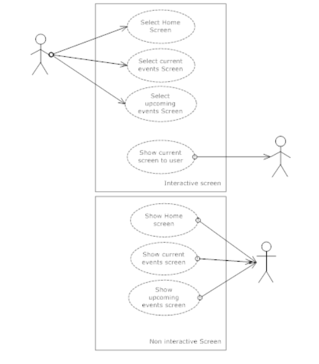
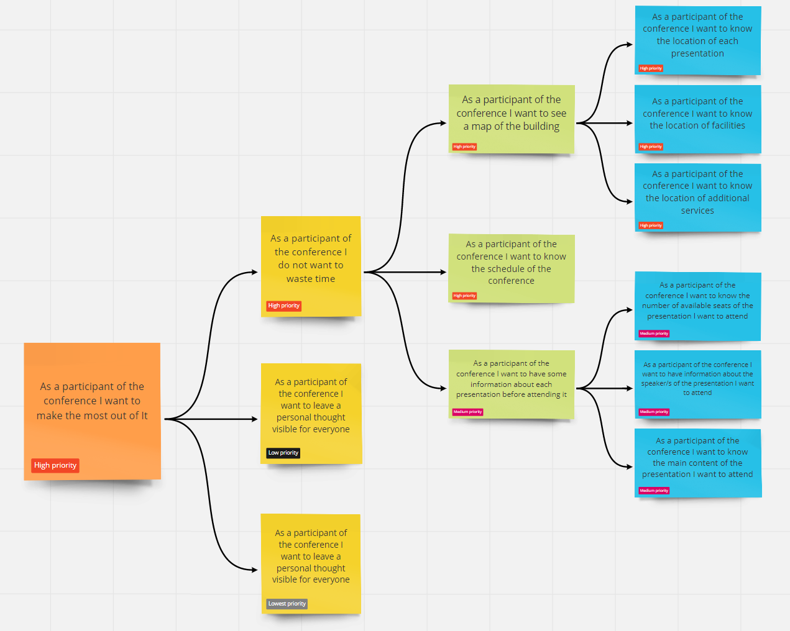
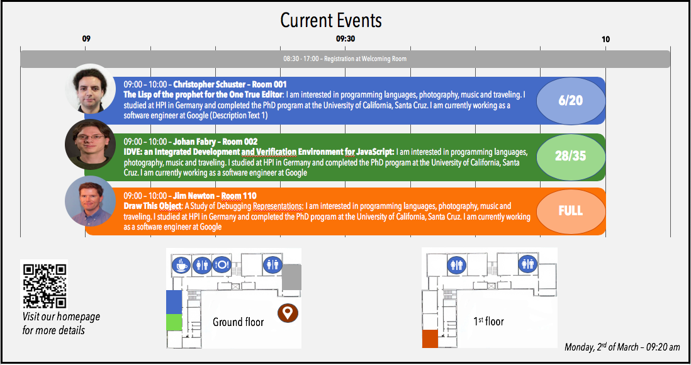
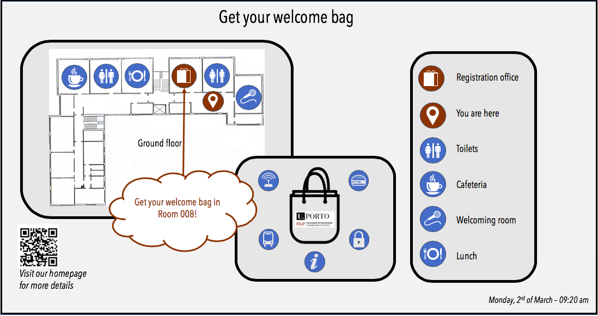
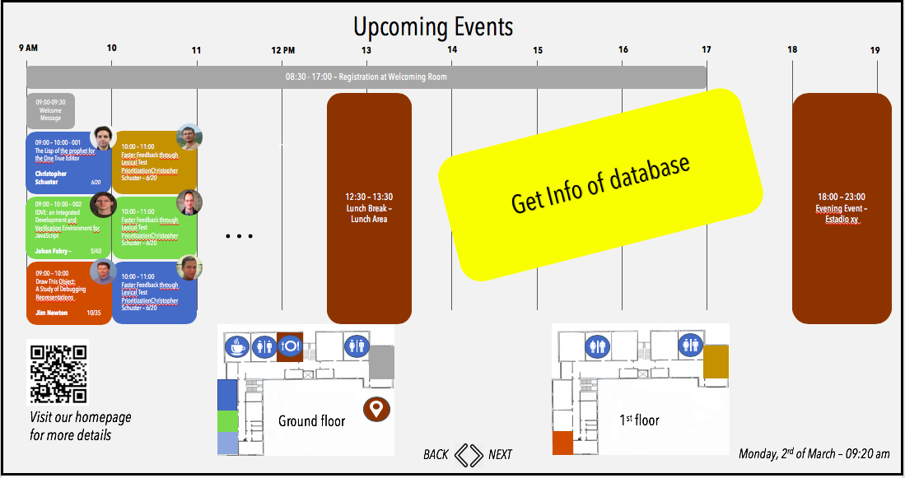
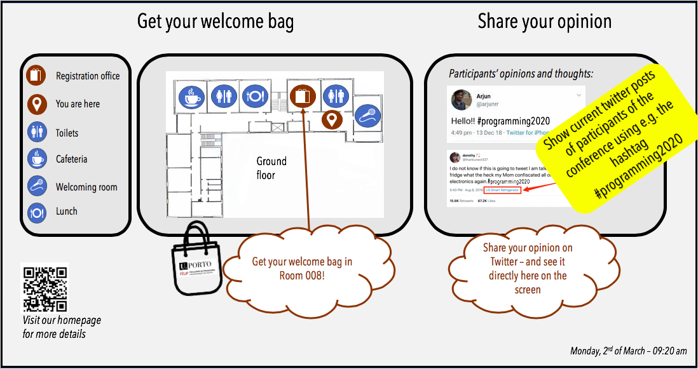
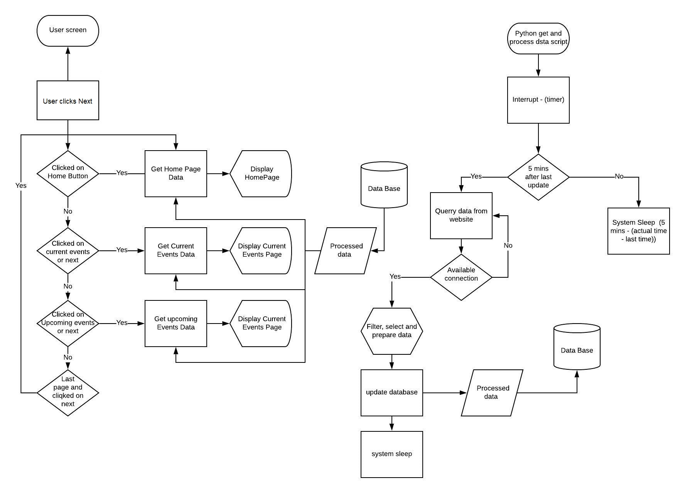
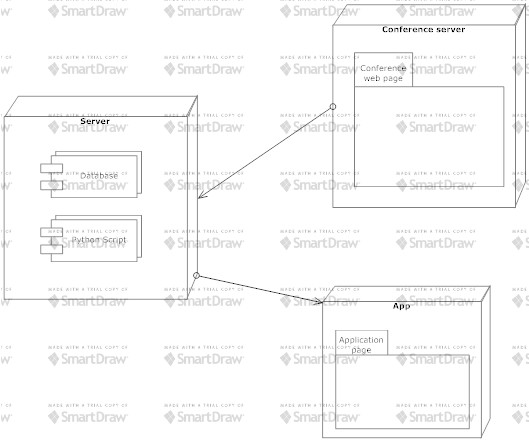

# openCX-SG Development Report

# Welcome to the documentation pages of Confmark. Your Conference Landmark. **openCX**!

Here you will find all information about the (sub-)projects.
You can find here details about the (sub)product, hereby mentioned as module, from a high-level vision to low-level implementation decisions, a kind of Software Development Report (see template), organized by discipline (as of RUP):

- [openCX-SG Development Report](#opencx-sg-development-report)
- [Welcome to the documentation pages of Confmark. Your Conference Landmark. **openCX**!](#welcome-to-the-documentation-pages-of-confmark-your-conference-landmark-opencx)
  - [Business modeling](#business-modeling)
    - [Product Vision](#product-vision)
    - [Elevator Pitch](#elevator-pitch)
  - [Requirements](#requirements)
    - [Use case diagram](#use-case-diagram)
    - [User stories](#user-stories)
      - [User interface mockups.](#user-interface-mockups)
      - [Acceptance tests.](#acceptance-tests)
    - [Domain model](#domain-model)
  - [Architecture and Design](#architecture-and-design)
    - [Logical architecture](#logical-architecture)
    - [Physical architecture](#physical-architecture)
    - [Prototype](#prototype)
  - [Implementation](#implementation)
    - [Part 1 - Python and Database](#part-1---python-and-database)
    - [Part 2 - Flutter app](#part-2---flutter-app)
  - [Test](#test)
  - [Configuration and change management](#configuration-and-change-management)
  - [Project management](#project-management)

So far, contributions are exclusively made by the initial team, but we hope to open them to the community, in all areas and topics: requirements, technologies, development, experimentation, testing, etc.

Please contact us!

Thank you!

Joanna Trojak, Sophia Bitterwolf, Tomasz Kubis, Filippo Gorlini and Iago Henrique Pires Moreira e Morais

## Business modeling

### Product Vision
Confmark. Your Conference Landmark.

Real-time overview of all necessary information about the conference at a glance presented on a screen.

### Elevator Pitch
Participants of a conference are often frustrated by the effort it takes to find the right room, remember when presentations start and if there is still a place for them. Confmark. Your Conference Landmark. solves this problem by providing all necessary information about the conference. With Confmark participants can find the available number of free seats, the room number, the timeslots as well as a short description of the lecturer and the presentation. A map of the building shows where to find sanitary facilities and all additional services. Our solution can be either accessed online or directly at the day of the conference on a big screen in the entrance hall. As the information is always up-to-date participants of the conference save time by always knowing where to go at which time. 
Confmark makes the conference stay as comfortable as possible.

## Requirements

### Use case diagram


 

### User stories

In order to create a user story map, we firstly collected all user stories which we want to integrate into our project.

The user stories can be find [here.](https://miro.com/app/board/o9J_kw8YdVc=/)



The sticky notes represent the user stories. 

We divided the tasks into 'information to know as soon as possible', meaning that the information is useful for the participant of the conference right now and 'information useful for later the day'.
As a third block, we try to create something that allows an interaction between the participant and the screen - 'Interaction with the screen'.
The three blocks are marked in blue.

Each of these blue blocks contain different subtasks that must be fulfilled. These are marked in yellow.
Below every subtask we collected the steps that must be fulfiled in order to implement the task.

Additionally we taged the different tasks with the labels 'priority 1-4'. Thus we know in which order we will work on the individual tasks. On top of these labels there are labels like 'in progress', 'done' or 'to-do'. This shows us the current working status of the task.

#### User interface mockups. 
Our mock-up shows what our product should approximately look like in the end. 






When showing the information online, there should additionally be buttons on the screens to navigate forward and backward.





An additional idea was that the participants of the conference could tweet something online and it would be directly shown on the screen. However, this is not the focus of our project and will only be implemented at the end, if capacity is still available.



#### Acceptance tests. 
The scenarios of the acceptance tests can be found [here.](
https://docs.google.com/document/d/19Oh2CPSlyLhVsH65iyrFKrGMntYt6AbZ7Bw0rdgcYr4/edit?usp=sharing)

Currently we are working on the must have scenarios, things which are the most crucial to the user. 

### Domain model
To better understand the context of the software system, it is very useful to have a simple UML class diagram with all the key concepts (names, attributes) and relationships involved of the problem domain addressed by your module.

## Architecture and Design
The architecture of a software system encompasses the set of key decisions about its overall organization.

A well written architecture document is brief but reduces the amount of time it takes new programmers to a project to understand the code to feel able to make modifications and enhancements.

To document the architecture requires describing the decomposition of the system in their parts (high-level components) and the key behaviors and collaborations between them.

In this section you should start by briefly describing the overall components of the project and their interrelations. You should also describe how you solved typical problems you may have encountered, pointing to well-known architectural and design patterns, if applicable.

### Logical architecture
The logical architecture can be found on a image below:

Basicaly there are a python script updating the database every 5 mins and a flutter aplication, querryng the database and showing to users.

### Physical architecture




FIrst, a python script runnin on our server querry and filter the data. Then, the data is sended to a database. The database tecnology isn't defined yet. 

The user interface is writen in flutter. Its a basic aplication to show the data in a very intuitive way. 


### Prototype

Our home screen is not an interactive screen. To test if our product is working, we show the mockups to some users and ask  questions about the conference.

## Implementation
Our implementation will be divided in 3 parts. The first one will be database modeling. To the app can querry data and show it without bugs, we will querry the data from presentation web site, filter and put in a NO sql database containing a Json. 

```java
{ 
        "Presentetion_title": "Lorem Ipsum" , 
        "Speaker":"Turpis Massa",  
        "Theme":"morbi quis commodo odio aenean", 
        "Abstract": "Lorem ipsum dolor sit amet, consectetur adipiscing elit, sed do eiusmod tempor incididunt ut labore et dolore magna aliqua. Ut enim ad minim veniam, quis nostrud exercitation ullamco laboris nisi ut aliquip ex ea commodo consequat. Duis aute irure dolor in reprehenderit in voluptate velit esse cillum dolore eu fugiat nulla pariatur. Excepteur sint occaecat cupidatat non proident, sunt in culpa qui officia deserunt mollit anim id est laborum.",
        "timestart" : "DD/MM/AAAA-HH:MM",
        "timeend"   : "DD/MM/AAAA-HH:MM",
        "HashTag"   : "_hash1, _hash2, _hash3" 
};
```

Then, we will divide the activities in 2 paralel branches. One is the python script and database implementatio. The second part is the interface implementation in flutter. 


### Part 1 - Python and Database
* Querry data from web
* Make a class with useful functions to deal with data format
* Make a database connector class
* implement the database
* implement tools to test the database, querryng data and printing it
* Make a doccumentation about the script and the tools

### Part 2 - Flutter app 

* Make the widget class
* Implement a homescreen showing the widgets 
* Implement a database conector
* process data and put it in a useful format inside aplication.
* test interface
* implement the automaticaly screen change every 1 minute
* implement navigation using buttons downpage. 
* test all functionalities

## Test

The test, in ourr cases is something simple. Basicaly, the interface has to change the info page every 1 minute. The information has to be clear and easy to see and read. 

Then, the tree butosn will be teste. When clicked, the screen has to change, and go to cerresponding button screen.


## Configuration and change management
Configuration and change management are key activities to control change to, and maintain the integrity of, a project’s artifacts (code, models, documents).

For the purpose of ESOF, we will use a very simple approach, just to manage feature requests, bug fixes, and improvements, using GitHub issues and following the GitHub flow.

## Project management
Software project management is an art and science of planning and leading software projects, in which software projects are planned, implemented, monitored and controlled.

In the context of ESOF, we expect that each team adopts a project management tool capable of registering tasks, assign tasks to people, add estimations to tasks, monitor tasks progress, and therefore being able to track their projects.

Example of tools to do this are:

Trello.com
Github Projects
Pivotal Tracker
Jira
We recommend to use the simplest tool that can possibly work for the team.
