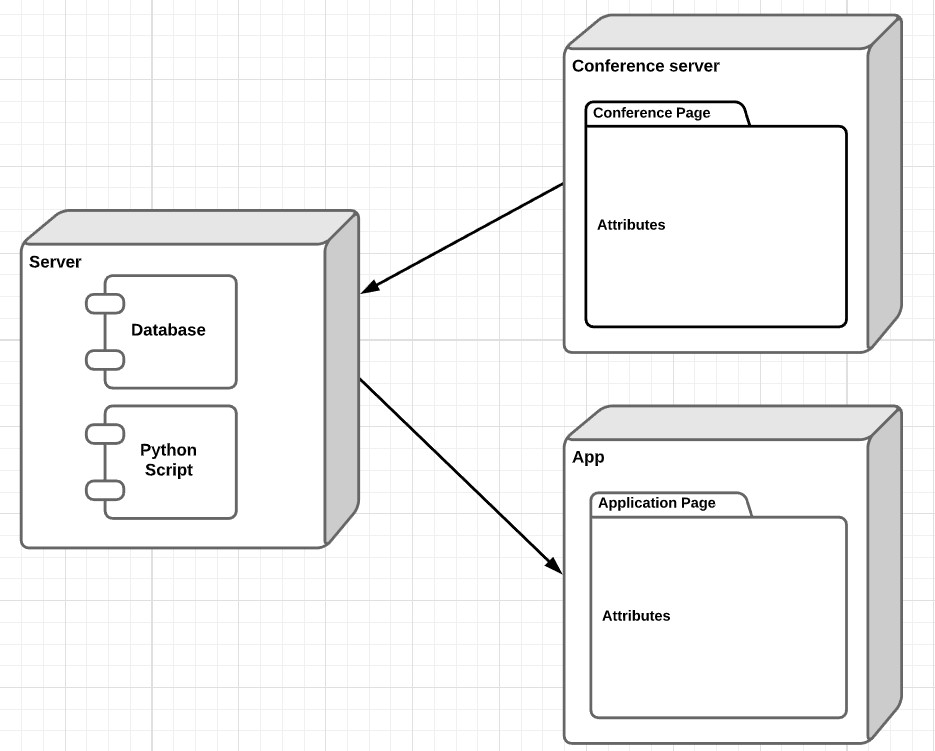

# openCX-SG Development Report

# Welcome to the documentation pages of Confmark. Your Conference Landmark. **openCX**!

Here you will find all information about the (sub-)projects.
You can find here details about the (sub)product, hereby mentioned as module, from a high-level vision to low-level implementation decisions, a kind of Software Development Report (see template), organized by discipline (as of RUP):

- [openCX-SG Development Report](#opencx-sg-development-report)
- [Welcome to the documentation pages of Confmark. Your Conference Landmark. **openCX**!](#welcome-to-the-documentation-pages-of-confmark-your-conference-landmark-opencx)
  - [Business modeling](#business-modeling)
    - [Product Vision](#product-vision)
    - [Elevator Pitch](#elevator-pitch)
  - [Requirements](#requirements)
    - [Use case diagram](#use-case-diagram)
    - [User stories](#user-stories)
      - [User interface mockups.](#user-interface-mockups)
      - [Acceptance tests.](#acceptance-tests)
    - [Domain model](#domain-model)
  - [Architecture and Design](#architecture-and-design)
    - [Logical architecture](#logical-architecture)
    - [Physical architecture](#physical-architecture)
    - [Prototype](#prototype)
  - [Implementation](#implementation)
    - [Part 1 - Python and Database](#part-1---python-and-database)
    - [Part 2 - Flutter app](#part-2---flutter-app)
  - [Test](#test)
  - [Configuration and change management](#configuration-and-change-management)
  - [Project management](#project-management)

So far, contributions are exclusively made by the initial team, but we hope to open them to the community, in all areas and topics: requirements, technologies, development, experimentation, testing, etc.

Please contact us!

Thank you!

Joanna Trojak, Sophia Bitterwolf, Tomasz Kubis, Filippo Gorlini and Iago Henrique Pires Moreira e Morais

## Business modeling

### Product Vision
Confmark. Your Conference Landmark.

Real-time overview of all necessary information about the conference at a glance presented on a screen in the entrance hall or easily on your smartphone or personal computer.

### Elevator Pitch
Hi, we are a young team sponsored by FEUP university and we know how frustrating it can be when you're at a conference and you can't figure out where to go, at what time and if there are still seats available for the presentation you want to see. The answer to those problems has now a name: Confmark.
With Confmark all the main information about the conference such as the timeslots, rooms codes, number of available seats as well as a brief description of the speakers and the presentations are displayed on a large screen. This makes it easy to spot the information immediately by all the participants, either accessed online or directly at the conference.
Forget all the time wasted deciphering small guides or asking people around you for those information now accessible at a glance, Confmark will make the conference to stay as comfortable as possible by always advising you where to go at which time. 


## Requirements

### Use case diagram


 

### User stories

In order to create a user story map, we firstly collected all user stories that we want to integrate into our project.

The user stories can be find [here.](https://miro.com/app/board/o9J_kw8YdVc=/)


The sticky notes represent the user stories. 

We divided the tasks into 'information to know as soon as possible', meaning that the information is useful for the participant of the conference right now and 'information useful for later the day'.
As a third block, we try to create something that allows an interaction between the participant and the screen - 'Interaction with the screen'.
The three blocks are marked in blue.

Each of these blue blocks contain different subtasks that must be fulfilled. These are marked in yellow.
Below every subtask we collected the steps that must be fulfiled in order to implement the task.

Additionally. we taged the different tasks with the labels 'priority 1-4'. Thus we know in which order we will work on the individual tasks. On top of these labels there are labels like 'in progress', 'done' or 'to-do'. This shows us the current working status of the task.

#### User interface mockups. 
Our mock-up shows what our product should approximately look like in the end. 


When showing the information online, there should additionally be buttons on the screens to navigate forward and backward.


An additional idea was that the participants of the conference could tweet something online and it would be directly shown on the screen. However, this is not the focus of our project and will only be implemented at the end, if capacity is still available.


#### Acceptance tests. 
The scenarios of the acceptance tests can be found [here.](
https://docs.google.com/document/d/19Oh2CPSlyLhVsH65iyrFKrGMntYt6AbZ7Bw0rdgcYr4/edit?usp=sharing)

Currently we are working on the must have scenarios, things which are the most crucial to the user. 

### Domain model
To better understand the context of the software system, we created a simple UML class diagram with all key concepts (names, attributes) and relationships involved of the problem domain addressed by our module.


## Architecture and Design
The software is divided into 2 parts: back-end and front-end.
  
### Back-end
The back-end is composed by a python script keeping the database up to date and a MySQL database. 
The data available on the presentation's website are downloaded, processed and stored in the database. 
  
### Front-end
Our application is built with symphony (PhP). 
  
In order to run the API, the machine on which the application will be executed must be prepared installing python3 and the libs described on the README.md document inside python_request_data directory. The database MySLQ and PhP & Symphony need also to be installed.

### Logical architecture
This is the logical architecture of our project.


There is a python script updating the database every 5 minutes and a flutter application, querying the database and showing it to the users.

### Physical architecture




Firstly, the python script running on our server queries and filters the data. Then, the data are sent to the database. The database technology isn't defined yet. 

The user interface is written in flutter. It is a basic application to show the data in a very intuitive way. 


### Prototype

Our home screen is not an interactive screen. 
To test our product, we showed the mockups to some users and asked them questions about what they understood and their opinions if they had any useful feedback.

## Implementation
The implementation is divided in 3 steps:
* Modelling of the database;
* The applications queries data from the conference's website and filters the data if any bug appears;
* The application can finally upload into a NO SQL database, containing a Json.


```java
{ 
        "Presentetion_title": "Lorem Ipsum" , 
        "Speaker":"Turpis Massa",  
        "Theme":"morbi quis commodo odio aenean", 
        "Abstract": "Lorem ipsum dolor sit amet, consectetur adipiscing elit, sed do eiusmod tempor incididunt ut labore et dolore magna aliqua. Ut enim ad minim veniam, quis nostrud exercitation ullamco laboris nisi ut aliquip ex ea commodo consequat. Duis aute irure dolor in reprehenderit in voluptate velit esse cillum dolore eu fugiat nulla pariatur. Excepteur sint occaecat cupidatat non proident, sunt in culpa qui officia deserunt mollit anim id est laborum.",
        "timestart" : "DD/MM/AAAA-HH:MM",
        "timeend"   : "DD/MM/AAAA-HH:MM",
        "HashTag"   : "_hash1, _hash2, _hash3" 
};
```

Afterwards, we divided the activities in 2 parallel branches. One branch regards the python script and the database implementation, the other regards the interface implementation on flutter. 


### Part 1 - Python and Database
* Query data from website
* Create a class with useful functions to deal with the data format
* Create a database connector class
* Implement the database
* Implement the tools to test the database, querry data and print it
* Write a documentation of the script and the tools

### Part 2 - Flutter app 

* Create the widget class
* Implement an homescreen showing the widgets 
* Implement a database connector
* Process the data and put them in a useful format inside the application
* Test the interface
* Implement the automatically screen change every 1 minute
* Implement the navigation using buttons
* Test all functionalities

## Test

In our case, the test can be deducted very easily. Basically, the interface has to change the info page every 1 minute. The information has to be clear and easy to see and read. 

Then, the three buttons will be tested. When clicked, the screen has to change, and go to the corresponding screen.


## Configuration and change management
Configuration and change management are key activities to control changes of project’s artifacts (code, models, documents) while maintaining their integrity.

For the purpose of ESOF, we used a very simple approach, just to manage feature requests, bug fixes, and improvements, using GitHub issues and following the GitHub flow.

## Project management
We documented the progress of our project on Trello. 
There are 5 iterations, each lasting two weeks. Before each iteration, we determined together which tasks had to be completed during the iteration and who takes over each task. All tasks are added to the column 'To Do'. As soon as someone was working on the task, it was moved to the 'Doing' column. Once a task was completed, it was moved to the 'Done' column. In 'Useful links' we collected links we often used.

This was our Trello board at the beginning of the project.


This was our Trello board for the first iteration.


This was our Trello board for the second iteration.


This was our Trello board for the third iteration.


This was our Trello board for the fourth iteration.


This was our Trello board for the fifth iteration.


Here you can find the link to our Trello Board:
https://trello.com/b/HOnUI9bu/sg-softeng?menu=filter&filter=label:%232


